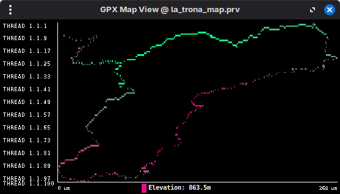

# gpx2prv

> **Disclaimer**: This project was vibe coded for fun and does not serve any practical purpose.

A C++ library and CLI tool for converting GPX files to Paraver trace format for visualization.

## Overview

GPX2PRV converts GPS track data from GPX format into Paraver trace files, enabling visualization of hiking, cycling, or running routes using the [Paraver](https://tools.bsc.es/paraver) high-performance trace visualization tool.

This allows you to analyze your routes with Paraver's powerful zoom, filtering, and statistical features.

## Building

### Prerequisites

- C++ compiler with C++11 support
- CMake 3.10+
- Paraver visualization tool (for viewing results)

### Build Steps

```bash
mkdir build && cd build
cmake ..
make -j4
```

Tests are built automatically. Run them with:

```bash
./tests/test_gpx
./tests/test_prv
```

## Usage

### Basic Usage

```bash
./gpx2prv_app <gpx_file> [output_prefix]
```

### Options

- `output_prefix`: Optional output file prefix (default: `output`)
- `--map`: Generate map view mode (longitude on X-axis, latitude on Y-axis)

### Visualization Modes

#### Elevation View (Default)

The default mode visualizes elevation by latitude:
- **X-axis**: Time
- **Y-axis**: Latitude (north at top, south at bottom)
- **Color**: Elevation (green = low, red = high)

```bash
./gpx2prv_app route.gpx my_route
wxparaver my_route.prv my_route.cfg
```

#### Map View (`--map`)

The map view provides a spatial visualization:
- **X-axis**: Longitude (east on right, west on left)
- **Y-axis**: Latitude (north at top, south at bottom)
- **Color**: Elevation (green = low, red = high)

```bash
./gpx2prv_app route.gpx my_route --map
wxparaver my_route_map.prv my_route_map.cfg
```

## Example

Using the example GPX file:

```bash
./gpx2prv_app examples/example.gpx example --map
wxparaver example_map.prv example_map.cfg
```

This produces a visualization of the "Throne of Siurana" hiking loop:



## Output Files

The conversion generates four Paraver files:

| File | Description |
|------|-------------|
| `.prv` | Trace data (time-stamped state records) |
| `.pcf` | Color configuration (elevation color bands) |
| `.row` | Row labels (latitude information) |
| `.cfg` | Window configuration for Paraver |

## Dependencies

- [pugixml](https://pugixml.org/) - XML parsing (fetched via CMake FetchContent)
- [Google Test](https://google.github.io/googletest/) - Unit testing (fetched via CMake FetchContent)

## Project Structure

```
.
├── include/gpx2prv/
│   ├── gpx.hpp      # GPX parsing API
│   └── prv.hpp      # Paraver conversion API
├── src/
│   ├── gpx.cpp      # GPX parser implementation
│   ├── main.cpp     # CLI application
│   └── prv.cpp      # Paraver trace generator
├── tests/           # Unit tests
└── examples/        # Example GPX files
```
